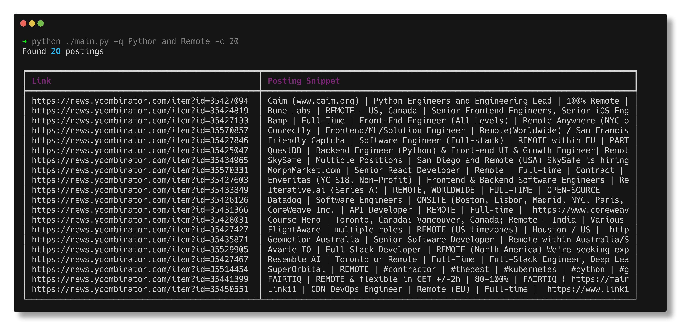

# Hacker News Job Posting Search

This Python CLI application allows you to search for job postings on Hacker News based on a given query text. It retrieves job postings using the [Hacker News API](https://github.com/HackerNews/API), indexes them using an SQLite full-text search (FTS) engine, and displays the search results with the help of the [Rich library](https://github.com/willmcgugan/rich).



## Installation

1. Clone the repository.

```
git clone https://github.com/amscotti/HNJobSearcher.git
cd HNJobSearcher
```

2. (Optional) Set up a virtual environment.

```bash
python -m venv .venv
source .venv/bin/activate  # On Windows: venv\Scripts\activate
```

3. Install the required dependencies.

```bash
pip install -r requirements.txt
```

## Usage

Run the following command to search for job postings:

```bash
python main.py -j <job_posting_id> -q <query_text> -c <search_count>
```

- `job_posting_id` is the ID of the job posting from Hacker News (default is `35424807`).
- `query_text` is the text you want to search for in the job postings (default is `"python AND remote"`).
- `search_count` is the number of job postings to return (default is `100`).

For example, to search for remote Python job postings, you can run:

```bash
python main.py -j 35424807 -q "python AND remote" -c 100
```

## Development

### Running Tests

Run all unit tests:
```bash
pytest
```

Run a specific test:
```bash
pytest tests/test_file.py::test_function_name
```

### Code Quality

Lint the code:
```bash
ruff check .
```

Check types:
```bash
pyright
```

Format code:
```bash
ruff format .
```

## Docker

Build the Docker image:

```bash
docker build -t your-image-name .
```

Run the Docker container:

```bash
docker run -it your-image-name -j your-job-posting-id -q your-query-text -c your-search-count
```
